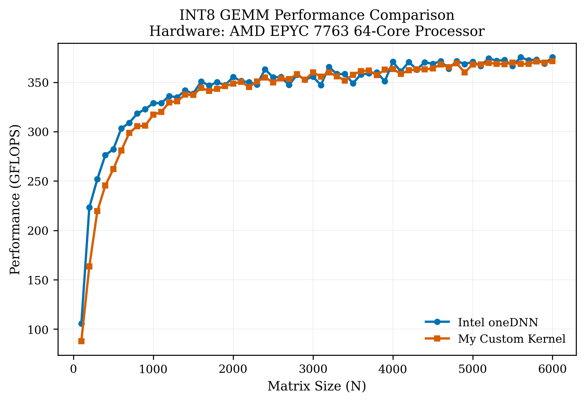

# INT8 GEMM on AVX2 - 98% of Intel's oneDNN

A hand-written s8s8s32 GEMM kernel in C, built from scratch on AVX2. Cache-blocked across all three levels, 6x16 micro-kernel running entirely out of L1 and registers, explicit prefetching, and OpenMP parallelization. Stays within 2% of Intel's oneDNN at large matrix sizes.

The more interesting result: oneDNN fails strict INT32 correctness validation. This kernel doesn't. The root cause is `_mm256_maddubs_epi16` INT16 saturation and oneDNN's fp32 alpha scaling at large N. Full explanation in the [blog post](https://hdahroug.github.io/optimizing-int8-gemm-avx2/).

> Note: on AVX-512 or AMX machines oneDNN will win by a significant margin. Those architectures have instructions this kernel intentionally doesn't use.

## Performance

Benchmarks run automatically on every push via GitHub Actions. Results vary by runner hardware but consistently stay within 2% of oneDNN at large matrix sizes.



## Key Design Decisions

**5-loop BLIS-style blocking.** The outer three loops tile M, N, K to fit panels into L3, L2, and L1 respectively. The innermost 6x16 micro-kernel works entirely from packed buffers already in L1 and registers.

**6x16 micro-kernel.** On AVX2 with 16 YMM registers: 12 accumulators for C, 2 for B, 1 for the A broadcast, 1 for the ones constant. 96 results per iteration, all 16 registers used, no register spilling.


**Signed-to-unsigned domain shift.** AVX2 only has `_mm256_maddubs_epi16` which requires unsigned times signed. `pack_A` converts s8 to u8 via `^ 0x80` (adding 128), then a vectorized correction subtracts `128 * col_sum(B)` from the output. This also steers intermediate products away from the INT16 saturation boundary that oneDNN hits.

**Autotuner.** Optimal MC, KC, NC values are larger than what cache size formulas predict because the hardware prefetcher and replacement policy have real effects. The autotuner grid-searches combinations of MC, KC, NC and finds the best values for the target machine before the kernel runs.

## Requirments

Requirements: GCC or Clang, CMake, OpenMP, oneDNN, Google Benchmark.

On Debian/Ubuntu:

```bash
sudo apt-get install -y cmake build-essential libomp-dev libdnnl-dev libbenchmark-dev
```

## Run

```bash
# Build the project
bash scripts/build.sh

# run the benchmark against oneDNN
bash scripts/bench.sh

# run correctness check against naive reference
bash scripts/test.sh
```

## Correctness

The kernel is validated against a naive C reference implementation. oneDNN is validated against the same reference. On hardware where inputs can trigger INT16 saturation in `_mm256_maddubs_epi16`, oneDNN fails. This kernel passes.

```
Correctness run against Naive trusted kernel:
[[[[ 4000 x 4000 x 4000 ]]]]]
error. 6592,-4917,0
====onednn-Failed-against-naive====
====Kernel-Passed-against-naive====
```

## How It Works

Full walkthrough of every design decision, from cache hierarchy to the register layout to the bias correction math: [Advanced INT8 GEMM Optimization on AVX2: 98% of Intel's oneDNN](https://hdahroug.github.io/optimizing-int8-gemm-avx2/)

## References

- [Fast Multidimensional Matrix Multiplication on CPU from Scratch](https://siboehm.com/articles/22/Fast-MMM-on-CPU) — Simon Boehm
- [Advanced Matrix Multiplication Optimization on Modern Multi-Core Processors](https://salykova.github.io/matmul-cpu) — Aman Salykov
- [BLIS: A Framework for Rapidly Instantiating BLAS Functionality](https://dl.acm.org/doi/10.1145/2764454) — Van Zee and van de Geijn
- [Intel Intrinsics Guide](https://www.intel.com/content/www/us/en/docs/intrinsics-guide/index.html)
- [oneDNN INT8 inference docs](https://uxlfoundation.github.io/oneDNN/dev_guide_inference_int8.html)

## License

MIT